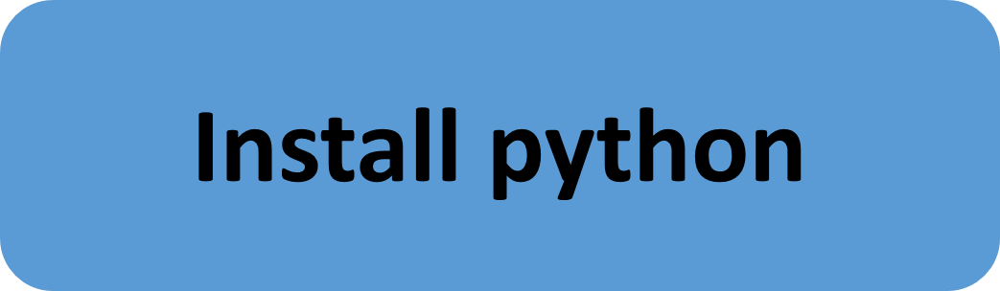

<a href="https://github.com/RWTH-EBC/EBC-Tutorials/README.md"></a><a href="1_Short_Introduction.md"></a><a href="2_Install_Python.md"></a><a href="3_Time_to_Say_Goodbye.md"></a><a href="4_Advanced_Concepts.md"></a>


# Time to say goodbye
This is the part, where we would like to wish you good bye for some time. Go away and learn Python (but ignore any tutorials how to install python. We got you covered above). If you aren't an experienced programmer, learning python will take some time. But doing it now correctly will save you a lot of time later on. And based on experience: Most students have enough time at the start of their thesis, at the end it is sometimes a bit more exhausting... .

- For those of you who read, [A Byte of Python](http://python.swaroopch.com/) is not only a silly pun but also a good introduction to Python. May take you some days to work through it.
- A [youtube playlist](https://www.youtube.com/playlist?list=PLkHsKoi6eZnwpn7P5G8gEBebAY8Jbky4N) with a fundamental programming course in Python from coursera (its about twice as long as Batman v. Superman but at least twice as fun!)
- If you are really ambitious, you may want to take the really good (but also really time consuming) Python course on [edx](https://www.edx.org/course/introduction-computer-science-mitx-6-00-1x-8).
- We'd also suggest that you take a short look at pandas, this is a package that can really help you to get work done. There is a [10 minutes to pandas](http://pandas.pydata.org/pandas-docs/stable/10min.htmlhttp://pandas.pydata.org/pandas-docs/stable/10min.html) guide, we are sure this won't be the 10 most wasted minutes in your life (remember the "cute cat" videos you watched last week? Or the last lecture you attended?).
- For specific questions on programming, [stackoverflow](http://stackoverflow.com/) is normally the place to go.

How deep you dive into learning to code is probably up to your interest and specific needs. We think that the ability to code efficiently is a key requirement (but we are also the guys that fancy [octocat](https://octodex.github.com/), so your mileage may vary). But before you continue, you should have at least an idea about these concepts (and if all of the concepts below are already clear to you: You may directly proceed):

- [ ] What are objects, and what is inheritance?
- [ ] What is the difference between a class and an instance?
- [ ] Your class `bar` has the attribute `foo`, how do you change it?
- [ ] What is a list comprehension?
- [ ] Why is this a bad way of using a for loop (hint: Iterate over the list itself)?:
```python
numbers = [1,2,3]
for i in xrange(3):
    print(numbers[i] * numbers[i])
```
