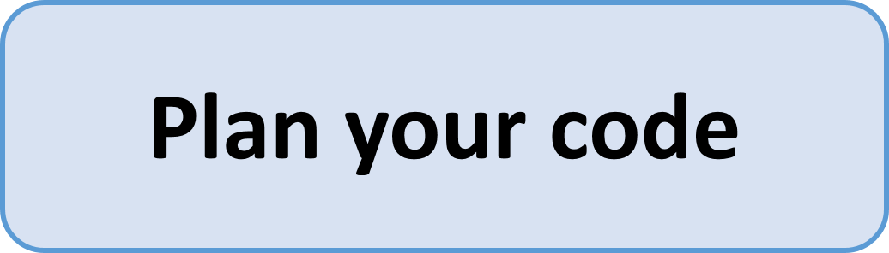

    

## Plan before you code
Yes, you probably have heard that before, and yes, each of us also started coding before thinking. Most time it is a bad decision, because it costs you time, you run into errors you would have avoided otherwise and maintaining the code is difficult.

So before you code, you should have a goal, for example: I want to plot the measured temperature data of two measurements. So than, what are your steps:

- Reading the data from the measurement file into python
- handle the data (even if temperatures where measured, you may want to check for measurement errors, missing data etc.)
- create the plot and save it

So you have at least three functions: Read the data, clean the data, create the plot. And if cleaning the data is some more work, this may be more than one function. After you got an idea, which functions you need, write the documentation for the functions. This will force you to do three things:

- Describe in one sentence, what the function does. If it this is difficult and/or contains a lot of "and"s, your function is probably too complex and should be broken down into some more functions
- Think about the input: What type of data is coming into your functions, may several data types be possible? Are there optional parameters to change the behavior of the function?
- Think about the output: What type of data does your data return? Is this always the same data type (it should be, because subsequent functions may expect a special data type)

If some of your functions are very similar, you may consider to write a smaller function, that is called by the other functions (if there is a bug in your code, you have to fix it only in one place, not in 42). And after you wrote the documentation (please write it as docstring and adhere to the docstring standards !LINK FEHLT), write the pseudo-code. That is a verbal expression of what you expect the code to do. This helps you to structure your work further, anticipate problems and works as documentation afterwards.

Yes, this all sounds boring. But it may save you some time. Time you could use to get your adrenaline kick elsewhere. And honestly: Otherwise you will be debugging the code more often. That is way more boring than creating code.

### Take away
Think what you want to achieve, structure this into functions, make up your mind about parameters and return values. Write the documentation. Write pseudo code. Now you may proceed to start coding.

