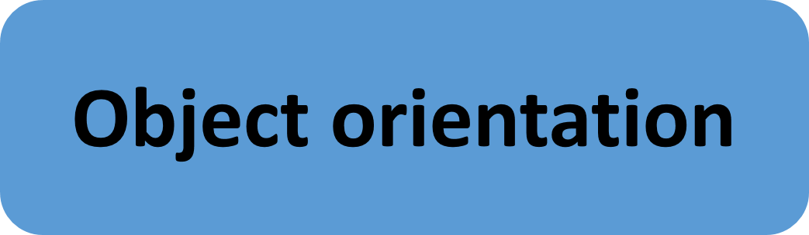
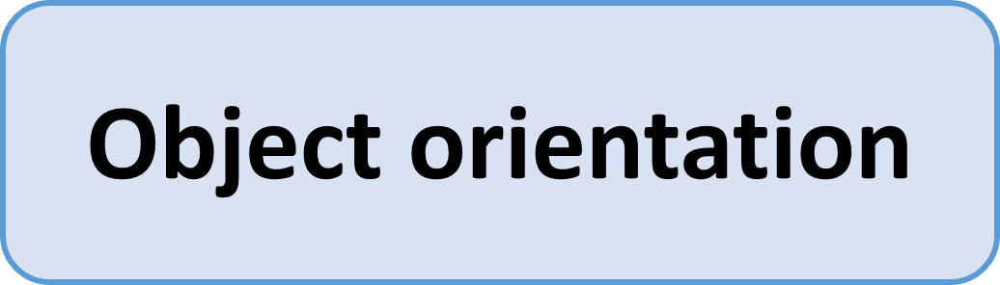

## Object Orientation
Object orientation is not the simplest possible programming method and it may take some time to be able to completely understand and endorse it. But if you have a slight idea about object orientation, it can save you some time. And for those of you who use Modelica: That one is also object oriented, so maybe one could expect some synergies.

The thing I like most about objects is, that they wrap information neatly together, you may add some additional information, you can define methods that help you handle your data, and from the outside: All instances look the same and behave the same.

Whatever you do in your work, you'll often have things that are basically the same, but with different data. That may be 10 different runs of an experiment, each with some changes in the hardware, or 1000 simulations with different parameters. You will try to compare them and figure out, which effects the changes have. So one base object would be at least an object to keep your experiment data and another object to keep those objects for comparison.

The difference between a class and the instance of a class is often described as the difference between a recipe and the cake. The recipe is the theoretically description how to bake cake, and the cake is - the cake. And often you can re-use parts of a recipe (throw everything in a bowle, mix it, put it in the oven), change some things (ingredients, time in the oven) and create a completely new cake. The realization of a recipe is the cake, same is true for a class, the realization is the instance. And as you can create several cakes from one recipe, you can also create several instances from one class.

The Jupyter Notebook ObjectOrientation in this folder gives some more ideas why object orientation can be helpful.

### Take away
Using object orientation simplifies your work by keeping your data structured. 
